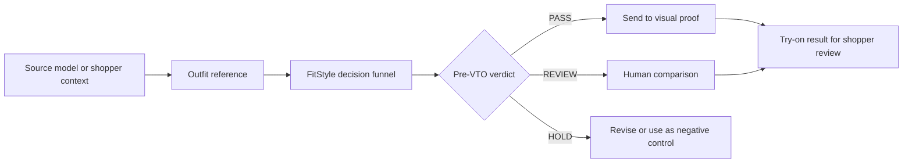

# FitStyle Map

FitStyle Map is a pre-VTO styling decision layer for apparel e-commerce.

Most virtual try-on demos start by sending a garment directly into image
generation. FitStyle Map adds the missing step before that: it checks whether
the garment shape, color, material, season, shoe line, and accessory placement
are likely to work for the selected body context before generating the final
try-on proof.

```text
Match the fit before generating the look.
```

## Judge Quick Start

If you are reviewing this project, start here:

1. Run the app locally with the setup commands below.
2. Open the product UI and run the pre-VTO gate on the three sample models.
3. Read `lib/publicDecisionEngine.ts` to inspect the decision logic.
4. Read `docs/architecture.md` for the system flow.
5. Read `docs/judge-review.md` for the YouCam API hackathon scoring angle.

Recommended category: **Fashion / Apparel VTO**. FitStyle Map is a consumer and
retail decision app that uses the YouCam fashion try-on layer as the final proof
after a pre-VTO fit decision.

## Product Concept

FitStyle Map helps retailers and shoppers answer one practical question:

```text
Should this outfit be sent to virtual try-on now, or should it be reviewed first?
```

The system turns styling into a decision funnel:

1. Select a source model or shopper context.
2. Read the outfit reference as a structured styling candidate.
3. Check scenario, silhouette, material, shoe, and accessory fit signals.
4. Return PASS, REVIEW, or HOLD before spending VTO generation cost.
5. Send only the right candidates into the visual proof layer.

This is useful because a VTO image can look technically complete while still
being a weak shopping recommendation. FitStyle Map separates "can generate" from
"worth generating".

## What Judges Can Review

This repository contains a runnable public version of the product flow:

- `app/FitStylePublicDemo.tsx`: interactive review UI.
- `app/api/fitstyle/pre-vto-decision/route.ts`: API route for the pre-VTO gate.
- `lib/publicDecisionEngine.ts`: auditable PASS / REVIEW / HOLD decision logic.
- `lib/publicSampleCases.ts`: sample source profiles, outfit cases, and public
  fit signals.
- `lib/publicContracts.ts`: typed request and response contract.
- `docs/architecture.md`: architecture diagrams and runtime flow.
- `docs/judge-review.md`: judge-facing checklist mapped to the official
  criteria.
- `docs/submission-alignment.md`: judging checklist and demo-video outline.
- `docs/youcam-api.md`: YouCam Fashion / Apparel VTO usage explanation.
- `docs/review-scope.md`: how to use the public repo and live staging app
  together.

## Official Submission Alignment

The repository is structured for the YouCam API Skin AI & Apparel VTO Hackathon:

- Working project: runnable Next.js app.
- YouCam API category: Fashion / Apparel VTO.
- Project description: product concept, problem, solution, and flow are covered
  in this README.
- Demo video: the live staging app should be shown end-to-end in a 1-3 minute
  public video, including how YouCam API is used.
- Screenshots: include the product UI, decision result, and YouCam proof flow in
  the Devpost submission.
- Code repository: source is public, typed, and small enough to inspect quickly.
- Setup guidance: install and run steps are below.
- Official judging criteria: `docs/judge-review.md` maps the project to
  technological implementation, design, potential impact, and idea quality.

## Architecture



See [`docs/architecture.md`](docs/architecture.md) for the fuller system view.

## Run Locally

```bash
npm install
npm run dev
```

Then open:

```text
http://localhost:3000
```

The local demo uses bounded sample cases and does not consume external provider
quota.

## Review Flow

1. Pick one of the source model cases.
2. Run the pre-VTO gate.
3. Inspect the verdict, confidence score, and public reasons.
4. Open the decision funnel panel to see how the product thinks.
5. Compare the code path with `lib/publicDecisionEngine.ts` and
   `docs/architecture.md`.
6. Use `docs/judge-review.md` as the final review checklist.

## MVP Scope

The MVP demonstrates the core product behavior:

- model-aware outfit selection
- positive and negative styling comparison
- pre-VTO decision logic
- cost-aware YouCam API dispatch concept
- readable reasons for judges, shoppers, and merchants
- architecture documentation that explains how the UI, API, decision engine, and
  YouCam proof layer fit together

The full staging experience adds the complete 30-outfit matrix, visual QA
boards, source calibration controls, and live YouCam dispatch.

## Safety And Use

FitStyle Map is a styling and retail-decision aid. It is not a medical,
identity, or exact tailoring system. It is designed to support outfit selection,
reduce weak VTO attempts, and make styling decisions easier to review.
