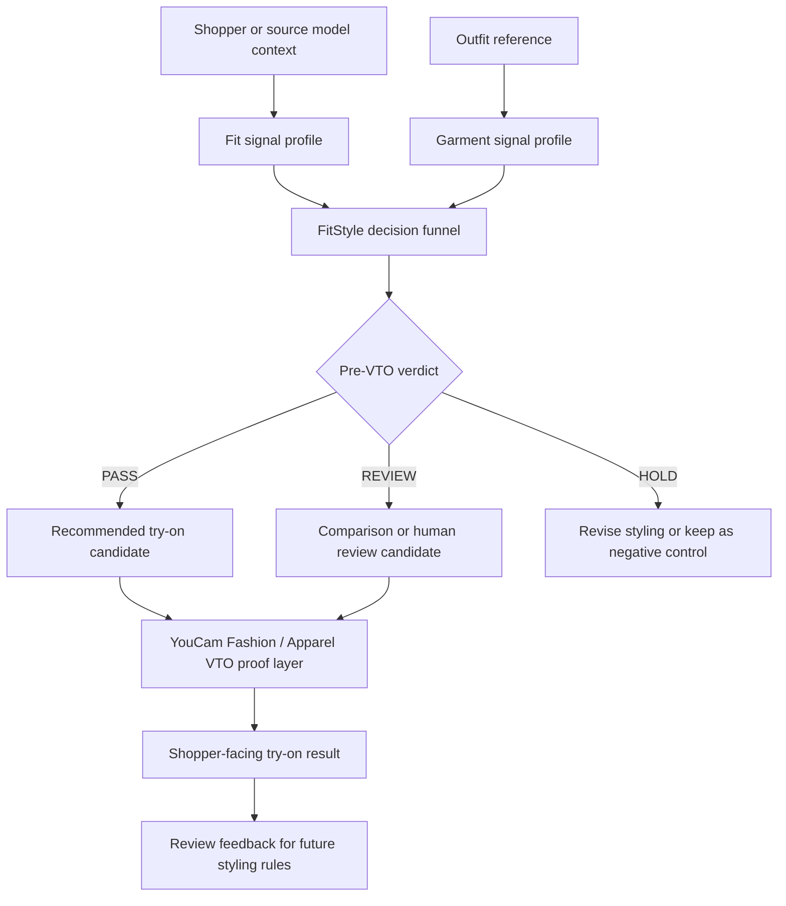
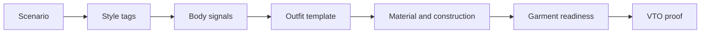
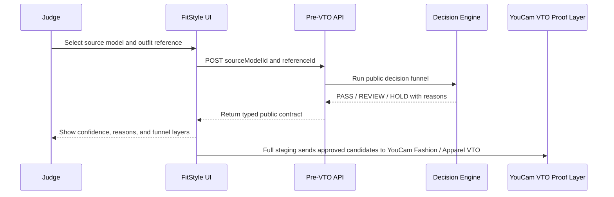

# Architecture

FitStyle Map is organized as a decision system before visual try-on. The core
idea is to judge whether an outfit is a strong styling candidate before asking a
VTO layer to produce the final visual proof.

## Product Architecture

## Decision Funnel

| Layer | Review Question |
|---|---|
| Scenario | Where will the outfit be worn, and what decision does the shopper need? |
| Style tags | Does the visual language match the scenario? |
| Body signals | Which public fit signals affect this styling decision? |
| Outfit template | Does the silhouette improve proportion before VTO? |
| Material and construction | Will the fabric behavior support the silhouette? |
| Garment readiness | Is the candidate ready enough to spend provider units? |
| YouCam VTO proof | Does the generated image confirm the decision for shoppers? |

## Runtime Flow

## Code Map

| File | Purpose |
|---|---|
| `app/FitStylePublicDemo.tsx` | Interactive product review surface |
| `app/api/fitstyle/pre-vto-decision/route.ts` | Public API route |
| `lib/publicDecisionEngine.ts` | Auditable decision logic |
| `lib/publicSampleCases.ts` | Sample product cases and fit signals |
| `lib/publicContracts.ts` | Typed API contract |

## YouCam API Cost-Control Concept

FitStyle Map treats YouCam Fashion / Apparel VTO as the final proof layer, not
the first screening step. The product can show send counters and confirmation
prompts so reviewers know generation cost is being managed while still allowing
hands-on testing.
