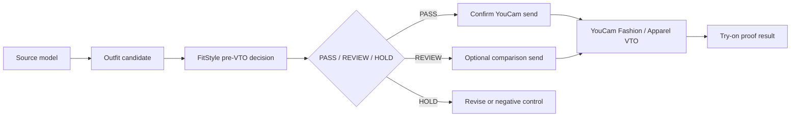

# YouCam API Usage

FitStyle Map uses **YouCam Fashion / Apparel VTO** as the visual proof layer.

The product does not treat virtual try-on as the first filter. FitStyle first
evaluates the outfit candidate, then sends approved looks to YouCam so the
shopper can inspect the final visual result.

## Where It Fits



## API Category

| Field | Value |
|---|---|
| YouCam category | Fashion / Apparel VTO |
| Product role | Final visual proof after FitStyle ranks the outfit |
| Input concept | Source model image + outfit/reference image + garment category |
| Output concept | Generated try-on result for shopper or reviewer comparison |

## Integration Shape

The live staging flow prepares a request with:

```json
{
  "src_file_url": "https://example.com/source-model.png",
  "ref_file_url": "https://example.com/outfit-reference.png",
  "garment_category": "full_body"
}
```

FitStyle only prepares this request after:

1. the source model is selected,
2. the outfit is selected,
3. the pre-VTO decision is visible,
4. the reviewer confirms the send action.

## Cost Control

The UI shows confirmation and send-count information before creating a YouCam
task. Recommended examples and negative comparison examples can both be tested,
but the reviewer can see that API usage is intentional and counted.

## What To Say In The Demo Video

Use this wording:

```text
FitStyle Map integrates YouCam Fashion / Apparel VTO as the proof layer. The
system first decides whether an outfit is worth trying on, then sends the
approved source/outfit pair to YouCam so shoppers can inspect the visual result.
This reduces weak VTO attempts and gives retailers a clearer comparison between
recommended looks and risk controls.
```
